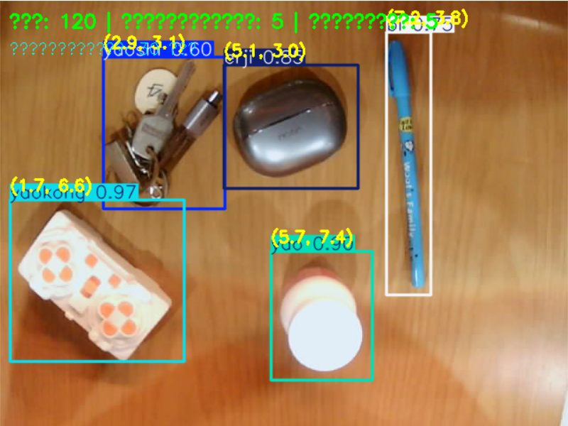
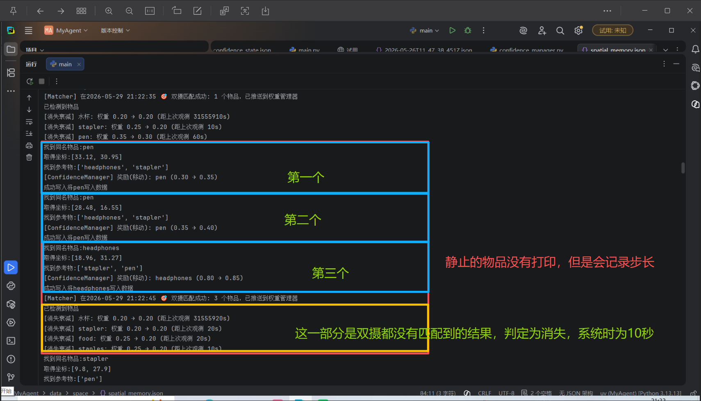
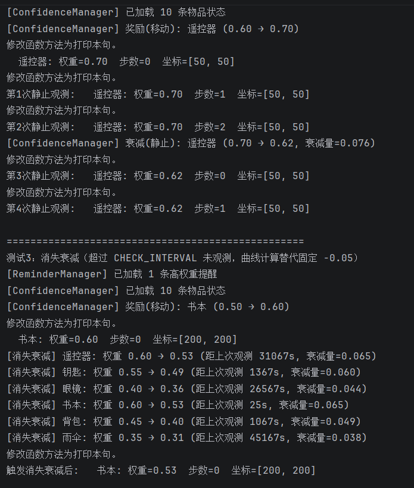
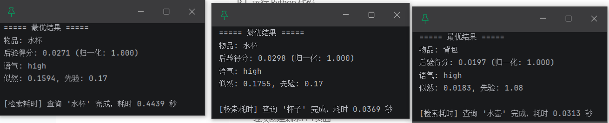
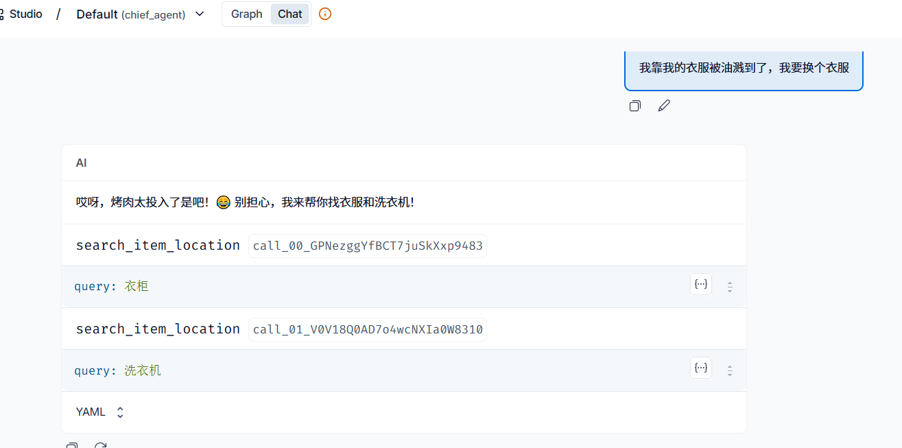

# 🏠 Homer – 具身智能家庭物品记忆助手

> 看见房间，记住物品，在对话中成长——回答你的每一个"找东西"的问题。

Homer 是一个集**双摄像头目标检测**、**动态物品显著性**、**空间与语义记忆**、**动态用户画像**与 **LLM Agent** 于一体的具身智能家庭物品管理助手。  
它能实时观察房间，记住每样东西的位置和"活跃度"，并且在每一次自然对话中逐步了解你的性格偏好，最终像一个真正了解这个家的伙伴一样帮你快速找到物品。

---

## ✨ 核心创新

- **双摄像头交叉验证**  
  全局俯视 + 移动视角同步检测，只有两个摄像头"同时看到"的物品才会被确认记录，大幅降低误检测。检测频率为每 30 帧执行一次 YOLO 推理。

- **动态物品显著性（Object Dynamic Salience）**  
  物品不是平等的——越常被移动的东西越"重要"，越容易被优先找回。  
  系统通过"移动奖励 + 静止衰减 + 消失衰减"三线机制，衰减量基于艾宾浩斯遗忘曲线计算（半衰期 120 秒），模拟人类的记忆规律，让记忆随时间自然演化。

- **空间记忆 + 参照物关系**  
  记录物品的坐标、空间编号、附近参照物、特征描述及其语义向量。检索时使用 BGE 模型计算用户查询与物品名称/特征/参照物的联合似然，结合权重×置信度的先验进行后验排序。

- **物品使用习惯分析**  
  通过长期观测物品在一天中不同时段（早/中/晚/深夜）的被使用频次，自动分析每个物品的常用时段，可在回答中灵活引用。

- **语义记忆（对话话题管理）**  
  对话会自动分段，每个话题由大模型生成摘要并保存为向量。当用户聊到之前的事情时，Homer 能主动回忆起相关上下文，真正实现长期对话记忆。

- **LLM Agent 自主决策**  
  基于 LangChain 的智能体会自主判断何时查询物品位置、何时搜索对话历史，无需固定的唤醒词。你只需要像跟人说话一样，说"我的水杯在哪儿？""还记得上次我们聊的那本书吗？"

- **动态用户画像**  
  通过对话内容持续提取用户的性格特质、兴趣偏好、价值观、沟通风格和生活习惯五维画像，并应用衰减与奖励机制进行动态调整，在最终回复中融入这些信息，使每一次交互都更个性化。

- **流式前端交互**  
  FastAPI + SSE 实现的流式聊天，支持历史会话管理、摄像头一键启停、用户画像可视化。

---

## 🎥 演示截图

- **如下类似 global 摄像头检测画面（非最终 puttext 结果），获取像素框中心坐标**
  > 

- **如下是物品权重增加、衰减机制**
  > 

- **26年6月更新衰减逻辑，引用人类记忆遗忘曲线**
  > 

- **利用贝叶斯模型计算物品的似然，先验概率是物品权重和摄像头的平均置信度**
- **思路源于一图胜千言**
- **往往会根据物品特征、参照物、物品位置、物品名称、物品描述逐步确定物品位置**
  > 
  > 至于为什么两次水杯结果不同？
  > 前者是词向量模型每一次都要对三个向量进行前向传播；
  > 后者是提前保存好向量结果，直接计算。

- **Agent 检索量化与效果展示**
  > 
  > 
  > 50 个测试数据，30 次测试召回率达到 92%，
  > 双记忆检索 Agent 的调用准确率约为 84%。
  > 测试用的是静态数据（spatial_memory.json 文件数据）；
  > 分别有专属名称检索如"帮我找找水杯"和模糊语义检索如上图所示。
  > 项目核心概念不仅仅包含准确的数据召回，
  > 还要能根据用户的需求以及习惯精确进行物品位置检索。
---

## 🧱 系统架构

```
┌────────────────────┐     ┌──────────────────────────┐
│   前端 (Vanilla)     │     │   FastAPI 后端             │
│   index.html       │◄───►│   /api/chat  (SSE)         │
│   + 摄像头按钮      │     │   /api/camera/start/stop   │
│   + 用户画像面板    │     │   /api/persona/{session}   │
└────────────────────┘     └──────────┬───────────────┘
                                      │
                         ┌────────────▼───────────────┐
                         │   LangChain Agent           │
                         │   (deepseek-chat)           │
                         │   + tools:                  │
                         │   - search_item_location    │
                         │   - search_conversation_mem │
                         │   ★ 动态拼接系统提示词      │
                         │   (用户画像 + 物品习惯)      │
                         └────┬──────────────────┬─────┘
                              │                  │
                    ┌─────────▼──┐       ┌──────▼─────────┐
                    │ 空间记忆    │       │ 语义记忆         │
                    │ BGE 检索    │       │ 话题分段+摘要    │
                    │ 乘法似然    │       │ 向量检索         │
                    │ 物品显著性  │       └──────┬──────────┘
                    └──────┬─────┘              │
                           │                    │
                           │        ┌───────────▼──────────┐
                           │        │ 用户性格画像管理器    │
                           │        │ PersonalManager      │
                           │        │ (LLM提取+衰减/奖励)  │
                           │        └───────────┬──────────┘
                           │                    │
            ┌──────────────▼─────┐              │
            │ 物品习惯分析器      │◄─────────────┘
            │ ItemHabitManager   │
            │ (时段频次分析)      │
            └──────┬─────────────┘
                   │
           ┌───────▼─────────────────────────────┐
           │    决策层 (Matcher)                  │
           │  双摄交叉匹配 / ConfidenceManager    │
           │  权重管理(移动奖励/静止衰减/消失衰减) │
           │  遗忘曲线衰减 / 高权重提醒管理        │
           └───────┬─────────────────────────────┘
                   │
           ┌───────▼───────┐
           │   感知层        │
           │   YOLOv8 双模型 │
           │   Camera+Mobile │
           │   摄像头驱动    │
           └───────────────┘
```

---

## 🚀 快速开始

### 1. 环境准备

- Python 3.13+
- 两个 USB 摄像头（或内置摄像头 + 外接，也可仅用对话模式）
- 建议使用虚拟环境

本项目使用 [uv](https://docs.astral.sh/uv/) 作为包管理器：

```bash
git clone https://github.com/你的用户名/homer.git
cd homer
uv sync
```

### 2. 配置

在项目根目录创建 `.env` 文件，填入必要 API Key（或设置系统环境变量）：

```
DEEPSEEK_API_KEY=sk-xxxxxxxx
```

编辑 `config.py` 中与硬件相关的参数（若无需摄像头，可跳过）：

```python
GLOBAL_CAM_ID = 0    # 全局摄像头设备索引
MOBILE_CAM_ID = 1    # 移动摄像头设备索引
```

### 3. 启动

```bash
uv run python main.py
```

打开浏览器访问 `http://localhost:8501`，在侧边栏点击"开启摄像头"启动物体检测，然后就可以在聊天框里向 Homer 提问了。  
即使不开启摄像头，系统也能通过纯对话模式进行物品检索和闲聊。

---

## 🔬 关键技术剖析

### 双摄像头匹配与权重管理
- **检测机制**：全局摄像头和移动摄像头各自独立运行 YOLOv8 推理，每 30 帧执行一次检测。
- **交叉匹配**：两个摄像头同时检测到同名物品且置信度 ≥ 阈值（默认 0.4）时，确认物品存在，记录全局摄像头的物理坐标。
- **参照物提取**：匹配时自动查找全局视角中距离物品最近的 2 个其他物品作为参照物。
- **三线权重模型**：
  - 移动奖励：物品坐标变化超过阈值 → 权重增加（遗忘曲线边际递减）
  - 静止衰减：连续多次未移动 → 步长累计达到阈值后触发衰减
  - 消失衰减：超过 CHECK_INTERVAL 未被任何摄像头观测到 → 触发衰减
- **遗忘曲线**：衰减量按 `factor = 0.5 ^ (CHECK_INTERVAL / FORGET_HALF_LIFE)` 计算，权重越高衰减越慢。
> 


### 物品使用习惯分析（Item Habit Analysis）
- 每次双摄确认观测时，记录物品出现的时间戳和坐标到轨迹文件。
- 后台线程每 300 秒分析一次轨迹数据，按小时将物品出现频次归入早/中/晚/深夜四个时段。
- 分析结果累加到摘要文件，轨迹数据随后清空。
- 摘要信息会注入 Agent 系统提示词，使回答更具个性化（如"水杯通常在早上被使用"）。

### 空间记忆检索
- 使用 BGE 模型将用户查询编码为向量，与物品的 `name`、`features`、`references` 三个字段的预存向量分别计算余弦相似度。
- 乘法似然：`likelihood = sim_name_boosted × sim_features × sim_refs`（带下限保护）。
- 先验：`prior = weight × confidence`。
- 后验分数 = 先验 × 似然，归一化后分为 high / mid / low 三个语气等级。

### 语义记忆（对话话题管理）
- **话题分段**：每轮用户消息的向量与当前区间中心向量计算余弦相似度，低于阈值（默认 0.6）时闭合当前区间。
- **摘要生成**：区间闭合后，调用 `deepseek-chat` 生成用户摘要和 AI 摘要，合并后编码为向量存入文件。
- **检索**：用户触发记忆查询时，用查询向量与所有历史摘要向量匹配，取 top-k 结果（综合向量相似度 + 重要性权重）。

### 动态用户画像
- 五维画像结构：`personality_traits`（性格）、`interests`（兴趣）、`values`（价值观）、`communication_style`（沟通风格）、`habits`（习惯）。
- 每 5 轮对话触发一次 LLM 提取，置信度范围 0.01~0.99，新特征初始在 0.68~0.72。
- 应用衰减与奖励机制：稳定特征获得小幅奖励，波动特征施加衰减。
- 画像摘要注入 Agent 系统提示词，前端侧边栏支持可视化查看和删除特征。

---

## 📂 目录结构

```
homer/
├── main.py                 # 入口
├── config.py               # 全局配置
├──
├── application/            # 后端服务层
│   ├── web_ui.py           # FastAPI 后端（含 SSE 流式聊天、画像接口）
│   ├── data_exporter.py    # 会话/记忆/向量文件读写
│   └── static/
│       └── index.html      # 前端界面
├──
├── Agent/                  # LangChain Agent 层
│   ├── agent.py            # Agent 管理器（初始化 deepseek-chat 模型）
│   ├── tools.py            # 工具定义（search_item_location / search_conversation_memory）
│   └── tool_context.py     # 请求级上下文传递（contextvars）
├──
├── memory/                 # 记忆层
│   ├── spatial_memory.py   # 空间记忆检索（BGE 向量 + 乘法似然 + 先验后验）
│   └── semantic_memory.py  # 语义记忆（BGE 模型单例、话题分段、摘要生成、向量检索）
├──
├── perception/             # 感知层
│   ├── camera_stream.py    # 摄像头驱动（GlobalCamera / MobileCamera）
│   └── yolo_detector.py    # YOLOv8 目标检测（双模型：全局 + 移动）
├──
├── decision/               # 决策层
│   ├── matcher.py          # 双摄像头匹配引擎（30 帧检测 + 交叉匹配 + 保存循环）
│   ├── confidence_manager.py  # 权重管理器（移动奖励/静止衰减/消失衰减 + 遗忘曲线）
│   ├── high_weight_reminder.py # 高权重物品提醒管理器
│   └── personal/           # 个性化模块
│       ├── Peronal_manager.py  # 用户性格画像管理器（五维 + LLM 提取 + 衰减奖励）
│       └── item_habit_analyzer.py # 物品使用习惯分析器（时段频次分析）
├──
├── models/                 # YOLOv8 模型权重
│   ├── best_global.pt      # 全局摄像头模型
│   ├── best_mobile.pt      # 移动摄像头模型
│   └── yolov8n.pt          # 官方预训练轻量模型
├──
├── data/                   # 运行时数据（自动生成）
│   ├── space/              # 空间记忆 + 置信度状态 + 物品轨迹 + 习惯摘要
│   │   ├── spatial_memory.json
│   │   ├── confidence_state.json
│   │   ├── item_trajectories.json
│   │   └── item_habits_summary.json
│   ├── memory/             # 对话会话（每会话独立 JSON）
│   ├── vectors/            # 语义记忆向量（每 session 子目录）
│   ├── abstract/           # 话题摘要文件
│   ├── persona/            # 用户画像文件
│   └── reminder/           # 高权重提醒状态
└──
```

---

## 🔭 未来计划（Roadmap）

- [ ] **前端摄像头实时画面**：在前端展示全局和移动摄像头的检测画面。
- [ ] **对话反馈空间修正**：从用户纠正语句中自动更新物品位置和参照物。
- [ ] **物品关系图可视化**：在前端展示物品之间的关联网络。
- [ ] **更细粒度的对话反馈解析**：利用更强模型提取用户隐含的意图与纠正。
- [ ] **视觉特征融合**：引入 CLIP 等模型，直接用图像特征强化空间记忆。
- [ ] **多空间/多用户支持**：为不同房间和家庭成员维护独立的记忆和画像。
- [ ] **主动推送**：当某物品显著性异常升高但用户长时间未询问时，主动提醒。
- [ ] **开放 API**：提供标准化 REST API，便于集成到智能音箱、机器人等平台。

---

## 🧪 学术与商业价值

- **学术**：Homer 在类具身智能中即将引入**基于遗忘曲线的自适应物品显著性**和**对话驱动的动态用户画像**，探索了持续学习的服务机器人在家庭场景下的交互范式。
- **商业**：面向健忘人群、老年人、共享居住空间等，提供一种越用越懂你的物品管理方案。

---

## 📜 开源协议

本项目采用 [MIT License](LICENSE)。

---

## 🙏 致谢

感谢所有开源项目的支持，包括但不限于：  
[Ultralytics YOLO](https://github.com/ultralytics/ultralytics) · [LangChain](https://github.com/langchain-ai/langchain) · [DeepSeek](https://deepseek.com) · [BGE (BAAI)](https://huggingface.co/BAAI/bge-small-zh-v1.5) · [FastAPI](https://fastapi.tiangolo.com/)
